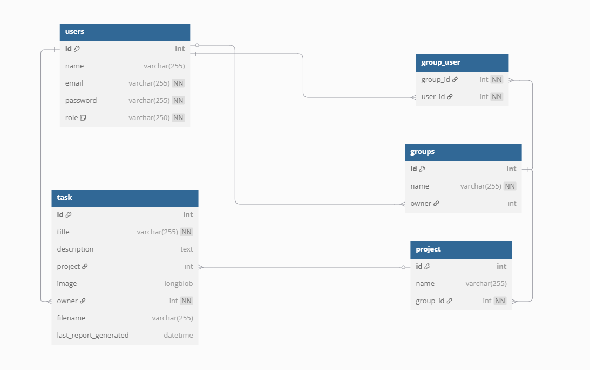

# 🗂 Task Manager

*Task Manager* is a web application designed to help users organize their personal and collaborative work. Users can create projects, add tasks within those projects, and group them for better team coordination. Whether you're managing your own to-dos or working with others, Task Manager makes it easy to plan and track tasks across multiple projects.

---
    

## 📘 Entities

The application manages the following main entities, which can be created, edited, viewed, and deleted:

- **User**
- **Group**
- **Task**
- **Project**

---

### 🔄 Key Relationships

- **User** ⇄ **Group** through 'likes' → N:M relationship
- **User** → creates multiple **Project** → 1:N relationship
- **Task** → belongs to only one **Project** → 1:N relationship

---

### 🔐 User Permissions

|             | Permissions                                                                                         |
|-------------|-----------------------------------------------------------------------------------------------------|
| Normal User | Can edit, delete their profile and data, create new projects, and join multiple groups to work on projects. The user will only be able to see the groups they are part of. |

> *Note:*  In this phase, the user is simulated as a basic user with privileges to create projects and join groups.

---

## 🖼 Task Images

When creating tasks, users have the option to attach images as complementary material.  
This feature allows for better visualization, the inclusion of references, or sharing of additional context for each task.

For example, you can:

- Attach screenshots related to the task.
- Add visual references or mockups.
- Include any supporting images that help describe the task clearly.

---

### 🗂️ Database Schema

This diagram illustrates the main entities of the application and their relationships, including a many-to-many association between users and companies through likes.

---

## 👥 Development Team

| Name                        | University Email                    | GitHub Username   |
|-----------------------------|-------------------------------------|-------------------|
| Roi Martínez Roque          | r.martinezr.2023@alumnos.urjc.es      | @RoiMartinezRoque |
| Juan Pablo Parra Avellaneda | jp.parra.2023@alumnos.urjc.es      | @jparra28         |
| Eduardo José Narros Sanchéz | ej.narros.2023@alumnos.urjc.es      | @eeduunrrs        |
| Lázaro Martínez Medina      | l.martinezm.2023@alumnos.urjc.es       | @Lazaro-123       |

---

## 🧪 Postman Collection

We include a Postman collection to test the REST API of this project.

- File: src/main/resources/postman/API-Taskmanager.json

### How to use it

1. Open [Postman](https://www.postman.com/downloads/).
2. Go to *File > Import*.
3. Select the file API-Taskmanager.json.
4. Make sure the API is running (http://localhost:8080 by default).
5. Execute the endpoints from the imported collection.

> The collection includes examples of entities such as tasks, users, etc.